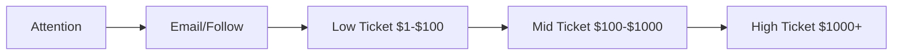

## Foundation

- What Is Copywriting?

- Copywriting Campus Core Values

- How To Accelerate your Ability To Learn And Work

- How To Ask Questions

- Why you should do MORE pushups

> Observe ➡️ Orient ➡️ decide ➡️ act 🔁

### Homework 1

1. colors selection and emphasis points.
2. pick the curiosity and interest with questions or sentences.
3. Facts.
4. beautiful design and presentation.
5. Good research of the subject at end.
6. The usefulnessand the impact of the product.

## How people work

> "Whoever impacts the reader at the deepest level, wins."

### Target Markets and Avatars

Your "target market" is the defined group of people who will get the most out of your product or service. By focusing on them, their intrests, dreams and roadblocks you can communicate in a way that allows you to impact them on a deeper level than anyone else. The most important thing is to as your self who's the target of this text.

Create an "avatar". An Avatar is a single person that embodies the characteristics of your target market. (The target market as one person.) The person that you think of as you write. This will give my riding a personal edge wich will benefit me alot.

- Name, age and face
- Backround and mini life history
- day-in-the-life.
- Values. Believes or what do they despise?
- outside forces (school parents etc) abuse this.

> Being specific > Being right

Sit down with your client and identify their most loyal high paying costumers thats your main avatar

### Human Motivators

> (How to propel someone to take action)

The two main reason for taking action:

- Running away from pain

  - "What is painful or frustrating in the current life of my avatar?"
  - "What do they fear?"
  - "What do they lie awake at night worrying about?"
  - "How do others negatively perceive them now?"
  - They are running towards pleasure

- Running toward pleasure
  - "If they could wave a magic wand at their life and fix everything, what would their life look like?"
  - "what enjoyable new experiences would they have?"
  - "How would others perceive them in a positive light?"
  - "How they feel about themselves if they made that change?"

### The Path To Change

How do you direkt them to solve their problems?

- roadblocks
- Use

> PS: NOT CLEAR!

### Homework 2

Start another deep work session and based on context clues inside the sales page,

Answer these questions:

- Who do you think the ideal target market for this product is?

  - Someone who is addicted to dopamine due to the sedation process. That would be a man deeply addicted to social media, to porn.
    A woman who has been binge watching tv shows and live every single day on social media. The age groups are between 12 to 40 years old.
    They are basically part of the "too long didn't read" (TLDR) generation. We have more and people who don't or have lost the hability to focus on long form of work.
    Any time they start doing long and difficult work, They willl reach for social media to get that dopamine hit and most of the time derailed out of the work.

- Create an Avatar that embodies the target market you determined. List out some of their qualities.

  - Sandro, 31 years old. He spent a decade part of his life watching and masturbating to porn. As a result, he had a very average college grades.
    He is functionning enough to get a 9-5 job. He had difficult time to stick to a side project. He do just enough to get the job done at office
    However even if Sandro problems are multivariate but everything comes down to his inability to focus and get things done.

- What are the pains and frustrations your avatar is experiencing?

  - He is not where he wants to be in life. He doesn't have enough focus to stay disciplined to the mission at end. Most likely, he migth be depressive by his
    inability to get any actions that would improve his life. And the sedation in place are damaging his dopamine levels and his focus. He know what to do and
    he might be even conscious and aware of this

- What does your Avatar desire? What does their dream life look like?

  - He want success like any other functionning human being. He want to be in shape and desirable by the opposite gender. Which means, he is free of porn and
    has the hability to express his sexuality with beautiful women.

- What is the key Roadblock keeping your Avatar from achieving their Dream State now?

  - the sedation that he allows willingly and routinely inplace in his life. At this point his dopamine levels in his brain are disrupt. By that effect, he can't perform to
    his optimum level. Sandro can't stick to a diet. He can't take risk and the drive to stay up on task.

- What is the Solution that will allow the Avatar to achieve their Dream State?

  - Qualia Pills. Although, he must take care of his urges. That pill, even as a placebo, would give him a sense of urgency. This would trigger a boost of confidence. A least it will
    be a good start to get his life back on track.

- How does the Product make it easier for the Avatar to implement the Solution and achieve their Dream State?
  - The simple fact of experimenting truth mental clarity and the creative state. The hability to create and make a mark in this world will definitely overpower the changes in his life.

## How business work

> why people gives your their hard earn money

### Business 101

Someone has to decide to give you money. **Both sides must feel like they're getting a good deal.**
**There is limitless money out there for people who can engineer mutually beneficial trades of value.**

### The Value Equation

$$Value = \frac{Dream\_Outcome \times Perceived\_Likelihood\_Of\_Success}{Time\_To\_Get\_Outcome \times Effort\_and\_Sacrifice}$$

Perception is based on comparaison. Weaponize this idea.

### Know, Like, And Trust

> Sales is a transfert of belief over a bridge of trust.

1. Business should provide social proof.
2. The indicators of authority.
3. The indicators of Competency.
4. Relatable and likable

**The more a business is trusted by their market, the more customers they will get, and the more they will
be able to sell them.**

### LTV and Scale

> Nothings fix bad math

They are two simple factors that will determine how much the business you work with will earn:

1. The amount of profit generated by customer (Lifetime Value / LTV)
2. The number of customers they help (Scale)

### The Value Ladder

> Whoever can spend the most to acquire a customer wins, **if you make the most per customer**

### Homework 3

- How do they establish trust with the reader?

  - Qualia mind establish trust with the readers because they seems legit. And they appears very professional and well versed within the field of neurology.

- What ways could this company increase LTV?

  - Qualia needs to provide more value ladder first before any monetary pitch. They must create a social media presence and create content offering tips around the improvement of brain functions such as dopamine detox, productivity hacks, meditation. That's putting free value up front. They can offer free ebooks and guidelines over the same topics. They can add a meditation, fitness and nutrition based youtube channel, the key point is to expose usage of the product by the instructor. And to finish, they can also reduce the garantee to 60 days. 100 days seems excessive.

## Research

You must research your client to be effective. You must know your _target market_. Next build the avatar of the reader. Understand the current state of the reader. understand the dream state of the reader. Your job is to work with them. Understand the roadblock to create the shift in their brain. Position the product as the key point on achieving the solution. Know the similar products goods and bads in order to better present your own product.

### Research sources

- clients and their customers
- Amazon Reviews (Reviews in General)
- Social Media
- Reddit
- Quora
- Google

### walkthrough

For this, I have a copy of the template in my google drive.

> The reseach template:

- Target Market
- Avatar
- Current State
- Dream State
- RoadBlocks
- Solution
- Product
